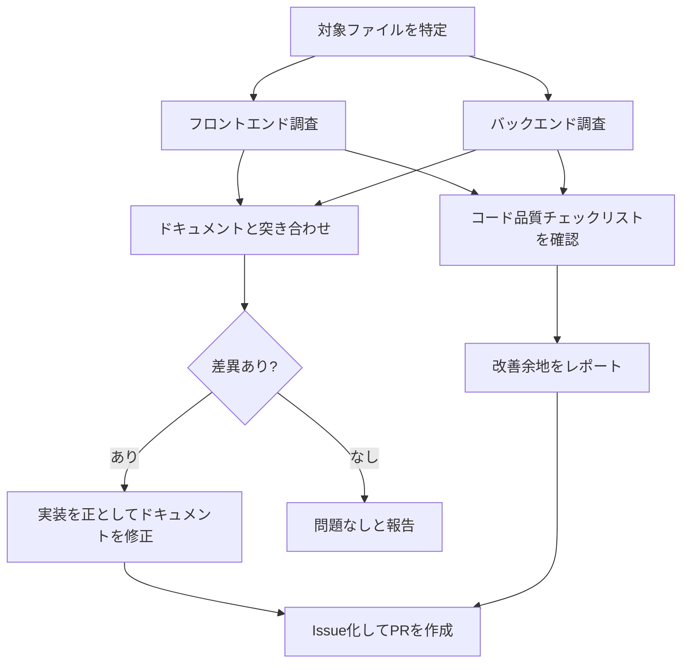

# 品質レビュー(quality-review)

このプロジェクトの実装品質とドキュメント整合性を、決まった観点で定期的にチェックするためのスキル。「品質チェックして」「実装とドキュメントが合っているか確認して」のような依頼を受けたら、このチェックリストに沿ってレビューする。

## レビューの流れ

## レビュー対象

- フロントエンド: `frontend/src/`（`components/`・`hooks/`・`api/`・`utils/`）、`frontend/.oxlintrc.json`、`frontend/package.json`
- バックエンド: `backend/src/main/java/com/example/trello/`（`controller/`・`service/`・`repository/`・`entity/`・`dto/`）、`backend/build.gradle`、`backend/src/test/`
- ドキュメント: `要件定義書.md`・`設計書.md`・`技術スタック.md`・`新規登録機能.md`・`更新機能.md`・`削除機能.md`・`検索機能.md`・`README.md`

## チェックリスト

### フロントエンド

- [ ] Lintツール（現状は`oxlint`）が導入されているか、`.oxlintrc.json`のルールが主要な観点（hooksルール等）をカバーしているか
- [ ] テストフレームワーク（Vitest/React Testing Library等）が導入されているか、テストファイルが存在するか
- [ ] 状態管理が一元化されているか（Props Drillingが浅く一貫しているか、不要なContext分散が無いか）
- [ ] `dangerouslySetInnerHTML`等、XSSリスクのあるレンダリングが無いか
- [ ] localStorage等、旧フェーズの永続化コードが残っていないか（デッドコード含む）
- [ ] Props/型検証の方針（TypeScript未導入なら`技術スタック.md`等に明記されているか）
- [ ] APIエラーハンドリングが一貫しているか（共通fetchラッパーの有無、ユーザーへのエラー表示有無）

### バックエンド

- [ ] レイヤ構成（`controller` → `service` → `repository`の分離）があるか、無い場合はその判断が意図的か
- [ ] 共通例外ハンドラ（`@ControllerAdvice`/`@ExceptionHandler`）があり、404/400/500等のエラーレスポンスの形が一貫しているか
- [ ] エンティティをレスポンスにそのまま返していないか（DTO/レスポンス専用の型があるか）
- [ ] バリデーション（`@Valid`・Bean Validationアノテーション）が主要な入力項目に付いているか
- [ ] Lint・静的解析ツール（Checkstyle/Spotless/PMD等）が導入されているか（フロントのLintツールと非対称になっていないか）
- [ ] CI（`.github/workflows`）でLint・テストが自動実行されているか
- [ ] テストカバレッジ（コンテキストロードのみでなく、Controller/Repositoryのテストがあるか）
- [ ] DB接続情報等のハードコードが、ローカル学習用途の範囲に留まっているか

### ドキュメント整合性

- [ ] `要件定義書.md`の機能一覧・画面仕様・ユースケースが、実際のコンポーネント・画面操作と一致しているか
- [ ] `設計書.md`のAPI設計表が、実際のエンドポイント・クエリパラメータ・レスポンスと一致しているか
- [ ] `新規登録機能.md`・`更新機能.md`・`削除機能.md`・`検索機能.md`等の個別機能ドキュメントが、対応するコンポーネント・APIの現状と一致しているか
- [ ] README.mdのドキュメント一覧・主な機能・開発フェーズの状態が現状と一致しているか
- [ ] 差異が見つかった場合は、実装を正としてドキュメント側を修正する（CLAUDE.mdの運用ルールに従い、Issue作成→ブランチ作成→修正→PR作成の流れで行う）

## 過去の実施記録

### 2026-08-07（初回実施）

見つかった主な指摘事項：

- **ドキュメント矛盾**: `要件定義書.md`のカード削除仕様が「確認なしで即削除」と記載されていたが、実装（`Card.jsx`の`window.confirm()`）は確認ダイアログを挟んでいた → 要件定義書側を修正
- **記載漏れ**: カード編集フォームからのステータス（列）変更・優先度順自動並び替えが要件定義書に未記載だった → 追記
- **記載漏れ**: 検索・並び替え機能（`SearchBar.jsx`/`SortControls.jsx`）が実装済みだが要件定義書・設計書ともに未記載だった → 要件定義書に機能追加、設計書のAPI設計表にクエリパラメータを追記、`検索機能.md`を新規作成
- **バックエンド品質**: `service/`層が無くControllerがRepositoryを直接呼んでいる、共通例外ハンドラが無く404/500の返し方が箇所によって不統一（不正な`priority`値が意図せず500になる等）、Checkstyle/Spotless等のLint・静的解析ツールが未導入（フロントの`oxlint`と非対称）、CIワークフローが無い、テストがコンテキストロードのみ
- **フロントエンド品質**: `.oxlintrc.json`のルール指定が最小限、テストフレームワーク未導入、`cardUtils.js`の`makeId()`が未使用のデッドコードとして残存

これらのうちコード側の課題は、初回実施時点では「報告のみ」で対応を見送っている（ユーザー判断待ち）。次回レビュー時に対応状況を再チェックすること。
