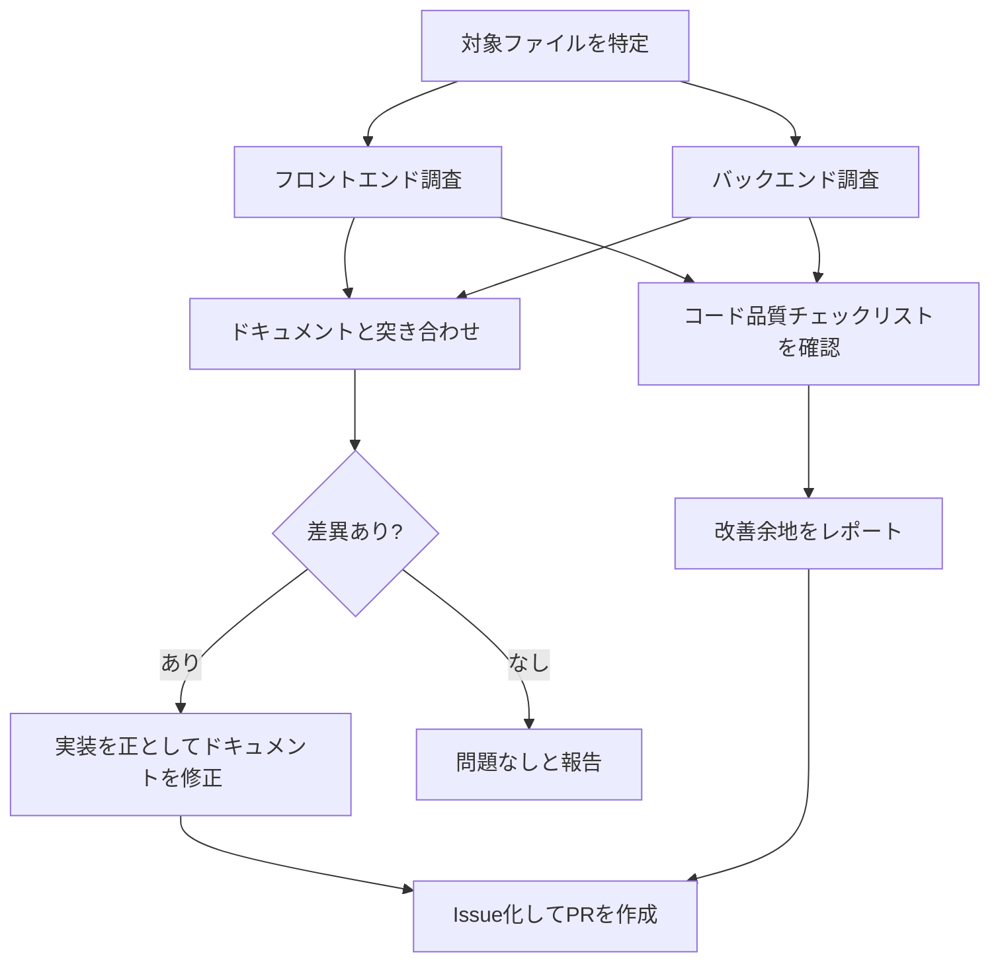

# 品質レビュー(quality-review)

このプロジェクトの実装品質とドキュメント整合性を、決まった観点で定期的にチェックするためのスキル。「品質チェックして」「実装とドキュメントが合っているか確認して」のような依頼を受けたら、このチェックリストに沿ってレビューする。

## レビューの流れ

## レビュー対象

- フロントエンド: `frontend/src/`（`components/`・`hooks/`・`api/`・`utils/`）、`frontend/.oxlintrc.json`、`frontend/package.json`
- バックエンド: `backend/src/main/java/com/example/trello/`（`controller/`・`service/`・`repository/`・`entity/`・`dto/`）、`backend/build.gradle`、`backend/src/test/`
- ドキュメント: `要件定義書.md`・`設計書.md`・`技術スタック.md`・`新規登録機能.md`・`更新機能.md`・`削除機能.md`・`検索機能.md`・`README.md`

## チェックリスト

詳しい観点・確認方法・なぜそれをチェックするのかの説明は[品質チェックリスト.md](../../../品質チェックリスト.md)を参照（人が読んで学ぶための詳細版）。このスキルはその要約版として、実行時に参照するチェック項目IDだけを一覧にしている。

### フロントエンド（FE-1〜FE-10）

- [ ] FE-1: Lintツール（現状は`oxlint`）が導入されているか
- [ ] FE-2: Lintルールが主要な観点（hooksルール等）をカバーしているか
- [ ] FE-3: テストフレームワーク（Vitest/React Testing Library等）が導入されているか
- [ ] FE-4: コンポーネントの責務が1ファイル1役割に分かれているか
- [ ] FE-5: 状態管理が一元化されているか（Props Drillingが浅く一貫しているか）
- [ ] FE-6: `dangerouslySetInnerHTML`等、XSSリスクのあるレンダリングが無いか
- [ ] FE-7: 未使用のデッドコードが残っていないか
- [ ] FE-8: APIエラーハンドリングが一貫しているか（共通fetchラッパーの有無、ユーザーへのエラー表示有無）
- [ ] FE-9: 環境変数・機密情報の管理が適切か（`.env`のgit管理状況等）
- [ ] FE-10: ファイル構成・命名規則に一貫性があるか

### バックエンド（BE-1〜BE-10）

- [ ] BE-1: レイヤ構成（`controller` → `service` → `repository`の分離）があるか
- [ ] BE-2: 共通例外ハンドラ（`@ControllerAdvice`/`@ExceptionHandler`）があり、404/400/500等のエラーレスポンスの形が一貫しているか
- [ ] BE-3: バリデーション（`@Valid`・Bean Validationアノテーション）が主要な入力項目を網羅しているか
- [ ] BE-4: エンティティをレスポンスにそのまま返していないか（DTO/レスポンス専用の型があるか）
- [ ] BE-5: Lint・静的解析ツール（Checkstyle/Spotless/PMD等）が導入されているか
- [ ] BE-6: CI（`.github/workflows`）でLint・テストが自動実行されているか
- [ ] BE-7: テストカバレッジ（コンテキストロードのみでなく、正常系・異常系のController/Repositoryテストがあるか）
- [ ] BE-8: DB接続情報等のハードコードが、ローカル学習用途の範囲に留まっているか
- [ ] BE-9: 検索・絞り込みがDBクエリで行われているか（全件取得＋アプリ側ループになっていないか）
- [ ] BE-10: 複数更新をまたぐ処理にトランザクション管理（`@Transactional`）の考慮があるか

### ドキュメント整合性（DOC-1〜DOC-5）

- [ ] DOC-1: `要件定義書.md`の機能一覧・画面仕様・ユースケースが、実際のコンポーネント・画面操作と一致しているか
- [ ] DOC-2: `設計書.md`のAPI設計表が、実際のエンドポイント・クエリパラメータ・レスポンスと一致しているか
- [ ] DOC-3: 個別機能ドキュメントが、対応するコンポーネント・APIの現状と一致しているか
- [ ] DOC-4: README.mdのドキュメント一覧・主な機能・開発フェーズの状態が現状と一致しているか
- [ ] DOC-5: ドキュメント間の相互リンクが切れていないか
- [ ] 差異が見つかった場合は、実装を正としてドキュメント側を修正する（CLAUDE.mdの運用ルールに従い、Issue作成→ブランチ作成→修正→PR作成の流れで行う）

## 実施記録の付け方

レビューを実施したら、見つけた内容を判定（✅/⚠️/❌）とともに[品質チェック記録.md](../../../品質チェック記録.md)に日付見出しで追記する。過去の記録は書き換えず、状況が変わったら新しい日付で追記していく（このファイル自体には実施記録を書かない）。
