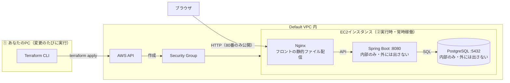

# AWS×Terraformデプロイ手順書

作成日: 2026-09-07
関連ドキュメント: [技術スタック](./技術スタック.md)・[設計書](./設計書.md)・[CLAUDE.md](./CLAUDE.md)

マネジメントコンソール（ブラウザの管理画面）をマウス操作するのではなく、コード（Terraform）とコマンドライン（AWS CLI）だけで、github-demo（Spring Boot + Vite のTrello風アプリ）をAWS上にデプロイするための手順書。AWS・Terraform・IaCが初めての人向けに、用語の説明を挟みながら進める。

対象: AWS未経験者 ／ 環境: Windows・PowerShell ／ 構成: EC2 1台からスタート ／ コスト目安: 無料利用枠の範囲内

## 目次

0. [そもそも何をするのか](#0-そもそも何をするのか)
1. [今回作る構成](#1-今回作る構成)
2. [AWSアカウントの下準備](#2-awsアカウントの下準備)
3. [AWS CLIと認証設定](#3-aws-cliと認証設定)
4. [Terraformのセットアップ](#4-terraformのセットアップ)
5. [Terraformの基本の流れ](#5-terraformの基本の流れ)
6. [インフラをコードで作る](#6-インフラをコードで作る)
7. [アプリを動かす](#7-アプリを動かす)
8. [動作確認](#8-動作確認)
9. [後片付けとコスト管理](#9-後片付けとコスト管理)
10. [セキュリティの基本](#10-セキュリティの基本)
11. [次のステップ](#11-次のステップ)
12. [用語集](#12-用語集)

---

## 0. そもそも何をするのか

今のgithub-demoは、自分のパソコン（localhost）でしか動いていない。これをインターネット上のどこからでもアクセスできる状態にするのが「デプロイ」。そのためには「サーバーを借りて置く場所」が必要になり、そこで**AWS**（Amazon Web Services）を使う。

> **用語 — AWS／クラウド**
> AWSはAmazonが提供する「レンタルサーバー屋さん」のようなもの。自分でサーバー機を買って部屋に置く代わりに、Amazonのデータセンターにあるコンピュータを必要な分だけ借りる。これを「クラウド」と呼ぶ。使った分だけ料金がかかる従量課金制で、使わなければほぼ無料（無料利用枠あり）。

AWSには数百種類のサービス（サーバーを貸す「EC2」、データベースを貸す「RDS」、ファイル置き場の「S3」など）があり、マネジメントコンソールからマウス操作で1つずつ作ることもできる。ただし今回はそれをやらない。

> **ポイント — なぜコンソールを使わずコードで作るのか**
> マウス操作でリソースを作ると、「何をクリックしたか」が記録に残らず、後で再現できない。もう1つ同じ環境が欲しくなったとき、また同じ手順を人力でなぞる必要がある。コードで書いておけば、実行するだけで何度でも同じ環境を再現でき、変更履歴もGitで管理できる。この「インフラをコードで管理する」考え方を**IaC**と呼ぶ。

> **用語 — IaC (Infrastructure as Code)**
> サーバーやネットワークの設定を、プログラムのコードのようなテキストファイルで書いて管理する手法。料理でいう「レシピ」に近い。レシピ（コード）さえあれば、誰が作っても同じ料理（同じインフラ）が再現できる。今回はこのレシピを書く言語として**Terraform**を使う。

> **用語 — Terraform**
> HashiCorp社が作ったIaCツール。`.tf`という拡張子のファイルに「こういうインフラが欲しい」という完成形を宣言的に書くと、Terraformが現在のAWS上の状態と見比べて、差分だけをAWSに指示して作ってくれる。「手順」ではなく「あるべき姿」を書く点がポイント。

> **用語 — AWS CLI**
> コンソール画面の代わりに、ターミナル（PowerShell）から`aws ...`というコマンドでAWSを操作するための公式ツール。Terraform自体もこの裏側でAWS CLIと同じ「認証情報」を使ってAWSと通信する。つまりCLIの認証設定は、Terraformを使うための前提条件でもある。

## 1. 今回作る構成

いきなり本格的な構成（複数サーバー、自動スケール等）を目指すと、覚えることが多すぎて挫折しやすい。最初のゴールは「1台のサーバー（EC2）の上で、今ローカルで動いているのと同じDocker Compose構成をそのまま動かす」こと。慣れてきたら、データベースだけを「RDS」という専用サービスに切り出す、フロントエンドを「S3」に置く、といった本格構成へ発展させる（[11. 次のステップ](#11-次のステップ)参照）。



左側：Terraformを実行してAWS上にサーバーを作る（構築）。右側：できたサーバーの中でDocker Composeの3つのコンテナが連携して動く（実行時）。外部に公開するのは80番ポートだけ。

> **AWS — 今回あえて簡略化していること**
> 本来AWSでは「VPC（仮想ネットワーク）を自分で設計する」のが基本だが、最初から作るとネットワークの用語だけで挫折しがち。今回は各AWSアカウントに最初から用意されている「Default VPC」を間借りする形にして、ネットワーク設計はいったん飛ばす。慣れてから[次のステップ](#11-次のステップ)で自分のVPCを設計する。

## 2. AWSアカウントの下準備

AWSアカウントを既に持っている前提。最初に必ずやっておきたいことが3つある。

| 手順 | 内容 |
|------|------|
| 1. ルートユーザーにMFA（多要素認証）を設定する | サインアップ直後のアカウント（ルートユーザー）はAWSの全権限を持つ。以後の作業はこのルートユーザーでは行わず、権限を絞った専用ユーザー（[3章](#3-aws-cliと認証設定)で作成）を使う。ルートユーザー自体には、コンソールの `IAM → セキュリティ資格情報` からMFA（スマホの認証アプリ等）を必ず設定する |
| 2. 予算アラート（Billing Alarm）を設定する | うっかり高額なリソースを立てっぱなしにする事故を防ぐため、コンソールの「Billing → Budgets」から「月$5を超えたらメール通知」のような予算アラートを1つ作っておく。無料利用枠内でも、範囲外のリソースを作ってしまうと課金される点に注意 |
| 3. リージョン（地域）を決める | 日本からアクセスするなら東京リージョン `ap-northeast-1` が定番。以降の手順もこのリージョンを前提にする |

> **注意**
> この章だけはマネジメントコンソール（ブラウザ）での作業。ルートユーザーのMFA設定と予算アラートは、性質上コンソールで行うのが安全かつ一般的。それ以外のリソース作成は、この後すべてコマンドとコードで行う。

## 3. AWS CLIと認証設定

AWS CLI・Terraformのどちらも、「あなたが誰で、何をしていいか」を確認するための**認証情報**が必要。ここが今回の最重要ポイント。

> **用語 — IAM／IAMユーザー**
> IAM (Identity and Access Management) は「誰が」「何を」してよいかを管理するAWSの仕組み。ルートユーザー（全権限）をアプリ開発の日常作業に使うのは危険なので、代わりに権限を絞った「IAMユーザー」を作り、そのユーザーの「アクセスキー」を使ってCLIやTerraformから操作する。

### 3.1 AWS CLIをインストールする

```powershell
# winget が使える場合
winget install -e --id Amazon.AWSCLI

# インストール確認
aws --version
```

### 3.2 作業用のIAMユーザーを作る（この1回だけコンソールを使用）

「IAMユーザーを作る」という最初の一歩自体は、鶏と卵の関係でCLIではまだ行えない（まだ認証情報がないため）。ここだけはコンソールから、以下の手順で1回だけ作成する。

1. **IAM → ユーザー → ユーザーを作成** — ユーザー名は `terraform-deployer` のようにわかりやすい名前にする
2. **権限を付与** — 学習目的の個人アカウントであれば、最初は `AdministratorAccess` を付けても構わない（ただしアクセスキーの漏洩リスクは高くなるので、[10章](#10-セキュリティの基本)の注意点を必ず読む）。本来は「EC2とVPCの操作だけ許可する」といった最小権限のポリシーを作るのが望ましい
3. **アクセスキーを発行** — 作成したユーザーの詳細画面 →「セキュリティ認証情報」タブ →「アクセスキーを作成」。用途は「コマンドラインインターフェイス (CLI)」を選択。表示される**アクセスキーID**と**シークレットアクセスキー**は、この画面を閉じると二度と表示されない。CSVでダウンロードし、安全な場所に保管する（Gitリポジトリには絶対に入れないこと）

> **ポイント — より安全な方法: IAM Identity Center**
> 長期間有効なアクセスキーを発行する方式は、漏洩したときのリスクが大きいという弱点がある。慣れてきたら「IAM Identity Center」+「aws sso login」という、有効期限付きの一時的な認証情報を使う方式に切り替えることをおすすめする。まずは基本を理解するため、今回はアクセスキー方式で進める。

### 3.3 CLIに認証情報を登録する

```powershell
aws configure

# 対話形式で聞かれるので入力する:
# AWS Access Key ID [None]: 発行されたアクセスキーID
# AWS Secret Access Key [None]: 発行されたシークレットアクセスキー
# Default region name [None]: ap-northeast-1
# Default output format [None]: json
```

この内容は `C:\Users\<ユーザー名>\.aws\credentials` というファイルに保存される。Terraformも含め、以後のAWS関連ツールはすべてこのファイルを自動的に読みに行く。

### 3.4 認証できているか確認する

```powershell
aws sts get-caller-identity
```

自分のアカウントIDとIAMユーザーのARN（AWS上の一意な識別子）が返ってくれば成功。エラーが出る場合は、キーの入力ミスかリージョン未設定が原因であることが多い。

## 4. Terraformのセットアップ

### 4.1 インストール

```powershell
winget install -e --id Hashicorp.Terraform
terraform -version
```

### 4.2 プロジェクト用フォルダを作る

github-demoリポジトリと同じ階層に、インフラ定義専用のフォルダを作る。アプリのコードとインフラのコードは分けて管理するのが一般的。

```powershell
cd "c:\Users\kuta6\AIエンジニア\github-demo"
mkdir infra
cd infra
```

> **用語 — ステートファイル (state file)**
> Terraformは「今どんなリソースを、自分がどんな設定で作ったか」を `terraform.tfstate` というJSONファイルに記録する。次に `terraform apply` するとき、このファイルとコードを見比べて差分だけを適用する。**絶対にGitにコミットしない**こと（中に一部の設定値が平文で入るため）。最初はローカルにファイルとして保存し（デフォルト動作）、チームで使うようになったらS3に保存する方式へ移行する。

## 5. Terraformの基本の流れ

Terraformを使う作業は、常に次の3〜4コマンドの繰り返し。

| コマンド | やること |
|----------|----------|
| `terraform init` | このフォルダで使うプロバイダー（今回はAWS用プラグイン）をダウンロードする。最初の1回、または設定を変えた時に実行 |
| `terraform plan` | コードの内容と実際のAWS上の状態を比較し、「これから何を作る／変える／消すか」をシミュレーションして表示するだけ（何も実行しない） |
| `terraform apply` | planの内容を確認したうえで、実際にAWSへ変更を反映する。実行前に `yes` の確認が入る |
| `terraform destroy` | コードで作ったリソースをすべて削除する。使い終わったら忘れずに実行（コスト管理） |

> **ポイント — たとえるなら**
> `plan` は「レシート発行前の見積もり」、`apply` は「実際の注文確定」。必ずplanで内容を確認してからapplyする習慣をつけると、意図しない削除・変更を未然に防げる。

## 6. インフラをコードで作る

`infra` フォルダの中に、役割ごとに複数の `.tf` ファイルを作る（1つのファイルにまとめても動くが、分けたほうが見通しが良い）。

### providers.tf — 「AWSを使う」という宣言

```hcl
terraform {
  required_version = ">= 1.7.0"
  required_providers {
    aws = {
      source  = "hashicorp/aws"
      version = "~> 5.0"
    }
  }
}

provider "aws" {
  region = var.aws_region
}
```

### variables.tf — 差し替え可能な設定値

```hcl
variable "aws_region" {
  default = "ap-northeast-1"
}

variable "project_name" {
  default = "github-demo"
}

variable "instance_type" {
  default = "t3.micro" # 無料利用枠の対象
}

variable "my_ip_cidr" {
  description = "SSH接続を許可する自分のPCのグローバルIP。例: 203.0.113.10/32"
  type        = string
}

variable "ssh_public_key_path" {
  default = "~/.ssh/id_rsa.pub"
}
```

> **注意 — 自分のグローバルIPの調べ方**
> PowerShellで `curl.exe ifconfig.me` を実行すると表示される。セキュリティグループのSSH（22番）を `0.0.0.0/0`（全世界）に開放すると、世界中から攻撃を受ける対象になるため、必ず自分のIPだけに絞ること。

### main.tf — Default VPC・セキュリティグループ・EC2

```hcl
# すでにアカウントにあるDefault VPC/サブネットを参照する（新規作成しない）
data "aws_vpc" "default" {
  default = true
}

data "aws_subnets" "default" {
  filter {
    name   = "vpc-id"
    values = [data.aws_vpc.default.id]
  }
}

# 最新のAmazon Linux 2023 AMI（サーバーの雛形イメージ）を検索
data "aws_ami" "al2023" {
  most_recent = true
  owners      = ["amazon"]
  filter {
    name   = "name"
    values = ["al2023-ami-*-x86_64"]
  }
}

resource "aws_security_group" "app" {
  name        = "${var.project_name}-sg"
  description = "Allow SSH from my IP, HTTP from anywhere"
  vpc_id      = data.aws_vpc.default.id

  ingress {
    description = "SSH"
    from_port   = 22
    to_port     = 22
    protocol    = "tcp"
    cidr_blocks = [var.my_ip_cidr]
  }

  ingress {
    description = "HTTP"
    from_port   = 80
    to_port     = 80
    protocol    = "tcp"
    cidr_blocks = ["0.0.0.0/0"]
  }

  egress {
    from_port   = 0
    to_port     = 0
    protocol    = "-1"
    cidr_blocks = ["0.0.0.0/0"]
  }
}

resource "aws_key_pair" "deployer" {
  key_name   = "${var.project_name}-key"
  public_key = file(var.ssh_public_key_path)
}

resource "aws_instance" "app" {
  ami                    = data.aws_ami.al2023.id
  instance_type          = var.instance_type
  subnet_id              = data.aws_subnets.default.ids[0]
  vpc_security_group_ids = [aws_security_group.app.id]
  key_name               = aws_key_pair.deployer.key_name
  user_data              = file("${path.module}/user_data.sh")

  tags = {
    Name = "${var.project_name}-server"
  }
}
```

> **用語 — セキュリティグループ**
> サーバーの前に立つ「受付」のようなもので、「どのポート番号への通信を、どこから許可するか」を制御する仮想ファイアウォール。今回は「SSH（22番）は自分のPCからだけ」「HTTP（80番）は誰からでも」許可している。

### user_data.sh — サーバー起動時に自動実行するスクリプト

EC2は起動時にこのスクリプトを自動実行する。DockerとDocker Composeを入れ、リポジトリを取得して `docker compose up` するところまでを自動化する。

```bash
#!/bin/bash
dnf update -y
dnf install -y docker git
systemctl enable --now docker
usermod -aG docker ec2-user

curl -SL https://github.com/docker/compose/releases/latest/download/docker-compose-linux-x86_64 \
  -o /usr/local/bin/docker-compose
chmod +x /usr/local/bin/docker-compose

cd /home/ec2-user
git clone https://github.com/kuroda1995/github-demo.git app
cd app
docker-compose up -d --build
```

> **注意 — 現状とのギャップ**
> 今の `backend/docker-compose.yml` はPostgreSQLコンテナのみを定義している（バックエンド自体は `./gradlew bootRun` でローカル実行する前提）。この手順を実際に動かすには、[7章](#7-アプリを動かす)のとおり、バックエンドとフロントエンドをDockerイメージ化し、composeファイルに `backend`・`frontend` サービスとして追加する作業が必要。

### outputs.tf — 作った結果を表示する

```hcl
output "public_ip" {
  value       = aws_instance.app.public_ip
  description = "ブラウザでアクセスするIPアドレス"
}
```

### 実行する

```powershell
# infra フォルダ内で実行
terraform init
terraform plan -var="my_ip_cidr=<自分のIP>/32"
terraform apply -var="my_ip_cidr=<自分のIP>/32"
```

`apply` の最後に `Enter a value: yes` と聞かれたら `yes` と入力して確定する。数分待つと `public_ip` が表示される。

> **ポイント — 毎回 -var を打つのが面倒な場合**
> `infra/terraform.tfvars` というファイルに `my_ip_cidr = "203.0.113.10/32"` のように書いておくと、Terraformが自動で読み込む。このファイルは環境固有の値なので、`.gitignore` に入れて管理対象から外すこと。

## 7. アプリを動かす

「サーバーを作る」と「アプリを動かす」は別の話。EC2ができても、まだgithub-demoをコンテナとして動かせる状態にはなっていない。最低限、次の2つが必要。

### 7.1 バックエンド用のDockerfile（`backend/Dockerfile`）

```dockerfile
FROM eclipse-temurin:21-jre
WORKDIR /app
COPY build/libs/*.jar app.jar
EXPOSE 8080
ENTRYPOINT ["java", "-jar", "app.jar"]
```

### 7.2 フロントエンド用のDockerfile（`frontend/Dockerfile`、ビルド済みファイルをNginxで配信）

```dockerfile
FROM node:20-alpine AS build
WORKDIR /app
COPY . .
RUN npm ci && npm run build

FROM nginx:alpine
COPY --from=build /app/dist /usr/share/nginx/html
EXPOSE 80
```

### 7.3 composeファイルに3つのサービスをまとめる（リポジトリのルートに新規作成する `docker-compose.yml`）

```yaml
services:
  db:
    image: postgres:16
    environment:
      POSTGRES_DB: trello
      POSTGRES_USER: trello
      POSTGRES_PASSWORD: ${DB_PASSWORD}
    volumes:
      - db_data:/var/lib/postgresql/data

  backend:
    build: ./backend
    environment:
      SPRING_DATASOURCE_URL: jdbc:postgresql://db:5432/trello
      SPRING_DATASOURCE_USERNAME: trello
      SPRING_DATASOURCE_PASSWORD: ${DB_PASSWORD}
    depends_on:
      - db

  frontend:
    build: ./frontend
    ports:
      - "80:80"
    depends_on:
      - backend

volumes:
  db_data:
```

> **注意 — パスワードをコードに直書きしない**
> `DB_PASSWORD` のような秘密情報は、EC2上の `.env` ファイル（Gitには含めない）に入れて、composeがそれを読む形にする。慣れてきたらAWS Secrets ManagerやSSM Parameter Storeで管理する方法に進化させる。

backend/frontendそれぞれの `CorsConfig` やAPIの向き先（`.env` の `VITE_API_URL` 等）も、localhost前提の値からEC2のパブリックIP（または後述するドメイン）に変更する必要がある。この差し替え作業は、既存の設計に合わせて別途Issueを切って進めるのがおすすめ。

## 8. 動作確認

1. **ブラウザで確認** — `http://<terraform apply の出力の public_ip>` にアクセスし、画面が表示されるか確認する
2. **SSHでログインして確認**
   ```powershell
   ssh -i ~/.ssh/id_rsa ec2-user@<public_ip>
   docker ps
   docker compose logs -f backend
   ```
3. **よくあるつまずき** — 画面が表示されない場合、多くはセキュリティグループ（80番の許可漏れ）、user_dataスクリプトの実行失敗（`/var/log/cloud-init-output.log` で確認可能）、フロントのAPI向き先の設定ミスのいずれかが原因

## 9. 後片付けとコスト管理

学習用に立てたサーバーは、使わない時間も課金対象になり得る（無料利用枠には時間・容量の上限がある）。検証が終わったら、必ず片付ける。

```powershell
# infra フォルダ内で実行
terraform destroy -var="my_ip_cidr=<自分のIP>/32"
```

Terraformで作った分はこれで丸ごと消える。コンソール上の「請求ダッシュボード」で実際に費用が0円付近に戻っているかも、念のため定期的に確認する習慣をつける。

## 10. セキュリティの基本

- **アクセスキーは絶対にGitへコミットしない** — `.aws/credentials` はホームディレクトリ配下にあり、リポジトリの外
- **tfstateとtfvarsもコミットしない** — `infra/.gitignore` に `*.tfstate*` と `terraform.tfvars` を追加する
- **SSHの22番は自分のIPだけに絞る** — 全世界公開（`0.0.0.0/0`）は総当たり攻撃の的になる
- **使わないリソースはこまめにdestroyする** — 立てっぱなしが一番のコストとセキュリティリスクの原因
- **ルートユーザーは日常作業に使わない** — MFAを設定した上で、緊急時以外はIAMユーザーを使う

## 11. 次のステップ

1台のEC2で動く状態が確認できたら、以下の順で少しずつ「本番運用に近い構成」へ発展させていくのがおすすめ。いずれもTerraformのコードに数十行追加する形で進められる。

| 項目 | 内容 |
|------|------|
| RDSへ移行 | DockerのPostgreSQLコンテナをやめ、AWSのマネージドDBサービス「RDS」に切り出す。バックアップや障害対応がAWS側で自動化される |
| S3 + CloudFront | フロントエンドの静的ファイルをEC2から追い出し、S3（ファイル置き場）+CloudFront（世界中に配信網を持つCDN）で配信する |
| 独自VPC設計 | Default VPCの間借りをやめ、パブリック／プライベートサブネットを自分で設計する。DBをインターネットから完全に遮断できる |
| ECS Fargate | EC2を自分で管理する代わりに、コンテナの実行環境そのものをAWSに任せる。サーバーのOSパッチ管理などから解放される |
| ACM + Route 53 | 独自ドメインを取得し、無料のSSL証明書（ACM）でHTTPS化する |
| CI/CD (GitHub Actions) | mainブランチへのマージをトリガーに、ビルドとデプロイを自動化する |
| tfstateをS3に移行 | ステートファイルをS3に置き、DynamoDBでロックすることで、複数人・複数PCからでも安全にTerraformを扱えるようにする |

## 12. 用語集

| 用語 | 説明 |
|------|------|
| EC2 | AWSが貸してくれる仮想サーバー1台のこと。OSからログインして自由に使える |
| AMI | EC2を起動するときの「雛形イメージ」。OSやあらかじめ入っているソフトのスナップショット |
| VPC | AWS上に作る、自分専用の仮想ネットワーク空間 |
| サブネット | VPCをさらに小さく区切ったネットワーク区画 |
| セキュリティグループ | 通信の許可・拒否を制御する、サーバー単位のファイアウォール |
| IAM | 「誰が」「何を」してよいかを管理するAWSの権限管理サービス |
| プロバイダー（Terraform） | Terraformが特定のクラウド（AWS/GCPなど）を操作するためのプラグイン |
| リソース（Terraform） | Terraformのコードで「作りたい」と宣言する、AWS上の実体（EC2やSGなど）1つ1つ |
| ステートファイル | Terraformが「今何を作ったか」を記録するJSONファイル |
| ARN | AWS上のあらゆるリソースに割り振られる一意な識別子（住所のようなもの） |

---

実際にコマンドを実行する前に、[10. セキュリティの基本](#10-セキュリティの基本)と[9. 後片付けとコスト管理](#9-後片付けとコスト管理)の章に必ず目を通すこと。ブラウザで読みやすい図解付き版は別途Artifactとして共有済み。
