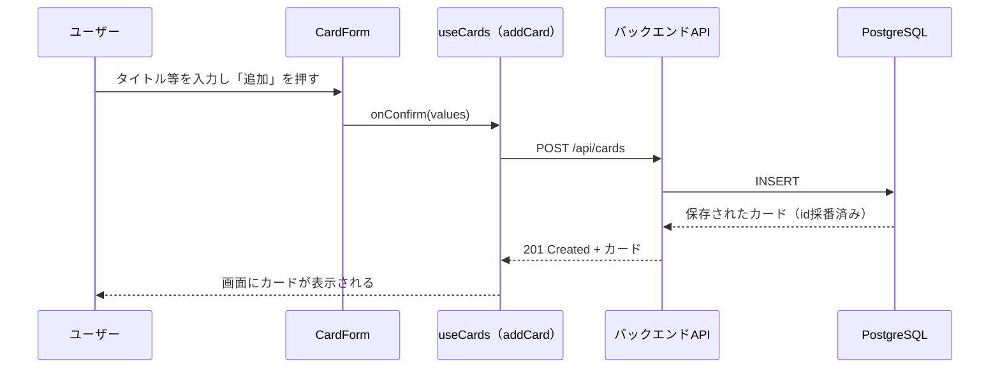

# 新規登録機能：カードの追加

作成日: 2026-08-06
関連ドキュメント: [要件定義書](./要件定義書.md)（3-2. カードの追加）／[設計書](./設計書.md)

フェーズ2（バックエンド・DB化）時点での、カード新規登録機能の実装内容をまとめる。

## 1. できること

- 各列（未着手／進行中／完了）の下部にある「＋カードを追加」ボタンから、その列に新しいカードを追加できる
- 入力できる項目：タイトル（必須）、説明文（任意）、優先度（任意、未指定時は「中」）、期限（任意）
- タイトルが空のままでは追加できない（簡単なバリデーション）

## 2. 画面操作の流れ

1. 対象の列の「＋カードを追加」ボタンを押す
2. 入力フォーム（`CardForm`）がその場に表示される
3. タイトルを入力し（説明文・優先度・期限は必要な場合のみ）、「追加」ボタンを押す、またはタイトル欄でEnterキーを押す
4. その列の一番下に新しいカードが追加される
5. 「キャンセル」ボタンまたはEscキーで入力を取り消せる

## 3. 関連ファイル（フロントエンド）

| ファイル | 役割 |
|----------|------|
| [Column.jsx](./frontend/src/components/Column.jsx) | 「＋カードを追加」ボタンの表示、押下時に`CardForm`を表示する状態（`isAdding`）を持つ |
| [CardForm.jsx](./frontend/src/components/CardForm.jsx) | タイトル・説明文・優先度・期限の入力フォーム本体。タイトル未入力時はフォーカスを戻して送信をブロックする |
| [useCards.js](./frontend/src/hooks/useCards.js) | `addCard(columnId, values)`：入力値をAPIに送信し、成功したら画面の状態（`cards`）に追加する |
| [cardsApi.js](./frontend/src/api/cardsApi.js) | `createCard(card)`：`POST /api/cards` を呼び出す薄いラッパー |

### 追加時の並び順

新しいカードは常にその列の一番下に追加される。列内の現在の最大`order`値に+1した値を使う（[cardUtils.js](./frontend/src/utils/cardUtils.js)の`nextOrder`関数）。

## 4. 関連ファイル（バックエンド）

| ファイル | 役割 |
|----------|------|
| [CardController.java](./backend/src/main/java/com/example/trello/controller/CardController.java) | `POST /api/cards`（`createCard`）：リクエストからカードを新規作成しDBに保存する |
| [CardRequest.java](./backend/src/main/java/com/example/trello/dto/CardRequest.java) | リクエストボディの型。`title`は必須（バリデーション） |
| [Card.java](./backend/src/main/java/com/example/trello/entity/Card.java) | カードのエンティティ（DBテーブル`cards`に対応）。IDは保存時に`UUID.randomUUID()`で自動採番される |

## 5. API仕様

| メソッド | パス | リクエストボディ | レスポンス |
|----------|------|-------------------|------------|
| POST | /api/cards | `{ title, description, priority, dueDate, columnId, order }` | 201 Created + 作成されたカード（`id`含む） |

- `title`が空・未指定の場合は400エラー（バリデーションエラー）になる
- `priority`未指定時はサーバー側で`medium`（中）として保存される
- `columnId`が存在しない列を指している場合は400エラーになる

## 6. データの流れ（概要）

