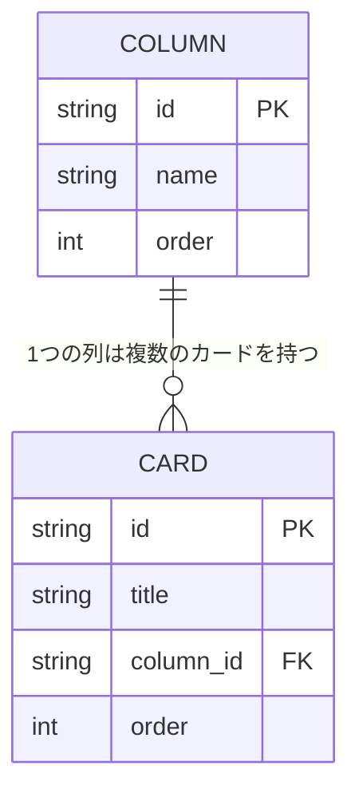

# 要件定義書：Trello風タスク管理アプリ（仮）

作成日: 2026-08-04
作成者: (ユーザー名を入れる)

## 1. 背景・目的

このアプリは、プログラミングスクールの課題として作成する。
実務で使う本格的なツールを作ることが目的ではなく、「Reactの基礎」「状態管理」「ドラッグ＆ドロップの実装」「ブラウザへのデータ保存（localStorage）」を、実際に手を動かして学ぶことが一番の目的。

やることを「未着手」「進行中」「完了」のような列に分けて、カードを動かしながら管理できる、シンプルなタスク管理アプリを作る。
本格的なチーム利用ではなく、個人の学習用・個人利用を想定する。

開発は2段階に分けて進める。

- **フェーズ1**：React＋localStorageで、まず画面とデータ操作の基本を完成させる（3〜9章の内容）
- **フェーズ2**：学習が進んだ段階で、保存先をlocalStorageから自作のバックエンド＋DBに置き換える（11章の内容）。複数人での利用（ログイン等）は引き続き対象外

### 学習目標（このアプリを通じて身につけたいこと）

| No | 学ぶこと | このアプリのどこで使うか |
|----|----------|--------------------------|
| 1 | Reactの基本（コンポーネント分割、props、state） | 列・カードをコンポーネントとして分ける |
| 2 | 状態管理 | カードの追加・編集・削除・移動の状態をどう持つか |
| 3 | ドラッグ＆ドロップの実装 | カードを列間で移動する機能 |
| 4 | ブラウザへのデータ保存 | localStorageを使った永続化（フェーズ1） |
| 5 | バックエンド・DBの基礎 | サーバーとDBを作り、ReactからAPI経由でデータを操作する（フェーズ2） |

## 2. 使う人

- 自分ひとり（このアプリを作る本人）
- 複数人での共有・ログイン機能は今回は対象外

## 3. できること（機能要件）

### 3-1. 必須機能（これが無いとアプリとして成立しないもの）

| No | 機能 | 説明 |
|----|------|------|
| 1 | リスト（列）の表示 | 「未着手」「進行中」「完了」の3つの列を画面に表示する |
| 2 | カードの追加 | 列の中に新しいタスク（カード）を追加できる |
| 3 | カードの編集 | カードのタイトルなどを後から書き換えられる |
| 4 | カードの削除 | 不要になったカードを消せる |
| 5 | カードの移動 | カードをドラッグして別の列に移動できる（例：未着手→進行中） |
| 6 | データの保存 | ブラウザを閉じて再度開いても、カードの内容が消えずに残っている（localStorageを使用） |

### 3-2. あったら嬉しい機能（後回しでもOK、今回は作らない）

| No | 機能 | 説明 |
|----|------|------|
| 1 | 列自体の追加・削除 | 「未着手／進行中／完了」以外の列も自由に作れる |
| 2 | カードの詳細情報 | 期限、担当者、色分けなどを追加できる |
| 3 | 複数人での共有 | ログイン機能を作り、他の人ともボードを共有する |
| 4 | サーバー保存 | ブラウザではなく、インターネット上にデータを保存する |

## 4. 対象外（今回は絶対に作らないもの）

- ログイン・会員登録機能
- スマホアプリ化（今回はパソコンのブラウザで動けばOK）
- 複数のボードを切り替える機能（ボードは1つだけ）

## 5. どうやって作るか（使用技術）

| 項目 | 使うもの | 理由（かんたんな説明） |
|------|----------|--------------------------|
| 画面づくり | React（＋Vite） | 部品（ボタンやカードなど）を組み合わせて画面を作れる道具 |
| ドラッグ操作 | @dnd-kit というライブラリ | カードをドラッグで動かす機能を自分でゼロから作らなくて済む部品集 |
| データ保存 | localStorage | ブラウザ自体が持っている「保存箱」。サーバー（裏方の仕組み）を用意しなくてもデータを覚えておける |

## 6. 画面仕様

### 6-1. 画面構成（レイアウト）

- 画面は1枚のみ（ページ遷移なし、SPA）
- 上部：アプリタイトルを表示するヘッダー
- 下部：3つの列（未着手／進行中／完了）を横に並べて表示するボードエリア
- PC（デスクトップブラウザ）での表示を前提とし、幅は最低1024px程度を想定する（スマホ対応は対象外）

### 6-2. 列（リスト）の仕様

| 項目 | 内容 |
|------|------|
| 表示内容 | 列名（例：未着手）、その列にあるカードの枚数、カード追加ボタン、カード一覧 |
| 並び順 | 未着手 → 進行中 → 完了 の固定順（列の並び替えは対象外） |
| カードが0件のとき | 「カードがありません」などのメッセージを列内に表示する |

### 6-3. カードの仕様

| 項目 | 内容 |
|------|------|
| 表示内容 | カードのタイトル（テキスト）、削除ボタン |
| 追加方法 | 列の下部にある「＋カードを追加」ボタンを押すと入力欄が表示され、タイトルを入力して確定するとカードが追加される |
| 編集方法 | カードをクリックすると、タイトルをその場で書き換えられる状態になる（インライン編集） |
| 削除方法 | カードの「×」ボタンを押すと、確認なしでその場でカードが消える |
| 移動方法 | カードを別の列までドラッグして離す（ドロップ）と、その列に移動する |
| 空タイトルの扱い | タイトルが空のままでは追加・保存できないようにする（簡単なバリデーション） |

## 7. ユースケース／操作フロー

### UC1. カードを追加する
1. 対象の列にある「＋カードを追加」ボタンを押す
2. 入力欄が表示されるので、タスクのタイトルを入力する
3. Enterキー、または「追加」ボタンを押す
4. その列の一番下に新しいカードが表示される

### UC2. カードを編集する
1. 編集したいカードをクリックする
2. カードが編集できる状態になるので、タイトルを書き換える
3. Enterキーを押す、またはカードの外をクリックする
4. 書き換えた内容でカードの表示が更新される

### UC3. カードを削除する
1. 削除したいカードの「×」ボタンを押す
2. その場でカードが列から消える

### UC4. カードを別の列に移動する
1. 移動したいカードを指定の列までドラッグする
2. 移動先の列でドロップ（指を離す）する
3. カードが元の列から消え、移動先の列に表示される

### UC5. 保存したデータを再度開く
1. カードを追加・編集・削除・移動した状態でブラウザを閉じる
2. 再度ブラウザでアプリを開く
3. 閉じる前と同じ状態（カードの内容・位置）が復元されている

## 8. 非機能要件

「機能要件」が”何ができるか”だとしたら、「非機能要件」は”どのくらいの品質・環境で動けばよいか”を決めるもの。今回はスクール課題かつ個人利用なので、厳しくしすぎず、現実的なラインで決める。

| No | 項目 | 決めた内容 | かんたんな理由 |
|----|------|------------|------------------|
| 1 | 対応ブラウザ | Google Chromeの最新版で動作すること | 開発・確認をChromeだけに絞ることで、学習に集中できるため |
| 2 | 画面サイズ | 幅1024px以上のPC画面を想定（スマホ・タブレットは対象外） | レスポンシブ対応は今回の学習目的に含まれないため |
| 3 | パフォーマンス | カードが50枚程度までは、操作（追加・削除・移動）がもたつかず動くこと | 個人利用の範囲であれば十分な量のため |
| 4 | データの永続性 | localStorageに保存し、ブラウザを閉じても消えないこと。ただし「ブラウザのデータを消去する」操作をした場合は消えてもよい | localStorageの性質上、それ以上の保証は技術的に難しいため |
| 5 | セキュリティ | 入力したタイトルがそのまま画面のHTMLとして実行されないようにする（XSS対策） | Reactを正しく使えば標準で対策されるが、意識して確認する |
| 6 | エラー処理 | localStorageへの保存に失敗した場合、画面が真っ白になったりせず、エラーメッセージを表示する | 最低限、アプリが動かなくなる事態を防ぐため |
| 7 | コードの品質・保守性 | コンポーネントごとにファイルを分け、命名やコメントを揃える | 課題として振り返りやすくするため |
| 8 | アクセシビリティ | 今回は対象外とする（キーボード操作のみでの完結などは求めない） | 学習の優先度としてはドラッグ操作の実装を優先するため |

## 9. 完成の目安（これができたら「完成」とする）

- 画面に3つの列（未着手／進行中／完了）が表示されている
- カードを追加・編集・削除できる
- カードをドラッグして列を移動できる
- ブラウザを再読み込みしても、カードの内容が消えない

## 10. 補足（実装前に決めておくこと）

### 10-1. データ構造（保存する情報の形）

localStorageには文字列しか保存できないため、下の形のデータをJSON（テキスト化した形式）に変換して保存する。

**カード1枚が持つ情報**

| 項目名 | 型 | 内容 | 例 |
|--------|----|------|-----|
| id | 文字列 | カードを区別するための一意な番号 | "card-1" |
| title | 文字列 | カードのタイトル | "買い物に行く" |
| columnId | 文字列 | どの列に属しているか | "todo" |
| order | 数値 | 同じ列の中での並び順 | 0, 1, 2... |

**列（カテゴリ）は3つで固定**

| id | 表示名 |
|----|--------|
| todo | 未着手 |
| doing | 進行中 |
| done | 完了 |

idの作り方は、`crypto.randomUUID()`（ブラウザに標準で用意されている、重複しないIDを作る機能）を使うと自分で採番ロジックを考えなくて済む。

### 10-2. 画面イメージ図（簡易ワイヤーフレーム）

```
+--------------------------------------------------+
|  タスク管理アプリ                                  |  ← ヘッダー
+--------------------------------------------------+
|  未着手 (2)   |  進行中 (1)   |  完了 (0)          |
|----------------|----------------|-------------------|
| [カードA]      | [カードC]      | カードがありません  |
| [カードB]      |                |                   |
|                |                |                   |
| [＋カードを追加]| [＋カードを追加]| [＋カードを追加]   |
+--------------------------------------------------+
```

### 10-3. 技術的な注意点（知らないとハマりやすい点）

| No | 注意点 | 内容 |
|----|--------|------|
| 1 | localStorageの容量制限 | ブラウザごとに5〜10MB程度の上限がある。今回の用途（テキストのみ）では問題にならない想定 |
| 2 | プライベートブラウジング | ブラウザの「シークレットモード」などでは、ウィンドウを閉じるとlocalStorageの内容が消える場合がある |
| 3 | JSONの読み込み失敗 | 保存されたデータが壊れている・想定外の形式だった場合、`JSON.parse`がエラーを出すことがあるので、失敗時は空のデータとして扱うなどの対応をしておく |
| 4 | ドラッグ＆ドロップの対応環境 | @dnd-kitはマウス操作を前提としており、タッチ操作（スマホ・タブレット）は追加の設定がないとうまく動かない場合がある（今回はPC想定のため対象外） |
| 5 | 複数タブでの操作 | 同じアプリを2つのタブで開いて両方操作した場合、後から保存した方でデータが上書きされる（複数タブの同時利用は対象外とする） |

## 11. フェーズ2：バックエンド・DB化

学習が進んだ段階で、データの保存先をlocalStorageから自作のバックエンド＋DBに置き換える。ここでの対象外（ログイン・複数ユーザー対応をしない）は変わらない。1人分のデータを、ブラウザではなくサーバー側で管理する、という変更のみ。

### 11-1. ER図（データの実体と関連）



- COLUMN（列）：todo／doing／doneの3件固定
- CARD（カード）：どの列に属するか（column_id）を持つ。列を消してもカードだけ残る、といった状態を防ぐため、column_idは必ずCOLUMNのいずれかのidを指す

### 11-2. 使用技術（フェーズ2で追加するもの）

| 項目 | 使うもの | 理由（かんたんな説明） |
|------|----------|--------------------------|
| バックエンド | Node.js＋Express | フロントエンド（React）と同じJavaScriptで書けるので、新しい言語を覚えずに済む |
| データベース | SQLite | ファイル1つで動く軽量なDB。専用のDBサーバーを別途立てなくてよく、個人学習に向いている |
| DBとのやり取り | SQL（学習が進んだらPrismaなどのORMも検討） | まずは生のSQLでテーブル操作の基本を理解してから、便利な道具を足す想定 |

### 11-3. API設計（概要）

ReactからDBへは直接アクセスできないため、間にAPI（サーバーへのお願いごとの窓口）を用意する。

| メソッド | パス | 内容 |
|----------|------|------|
| GET | /api/columns | 列一覧を取得する |
| GET | /api/cards | カード一覧を取得する |
| POST | /api/cards | カードを新規作成する |
| PUT | /api/cards/:id | カードのタイトル・所属する列・並び順を更新する |
| DELETE | /api/cards/:id | カードを削除する |

### 11-4. フェーズ2の完成の目安

- カードの追加・編集・削除・移動が、localStorageではなくDBに保存されている
- ブラウザを変えたり、いったんサーバーを再起動しても、DBに保存したデータは残っている
- ログイン機能・複数ユーザーの区別は無く、1人分のデータのみを扱う
