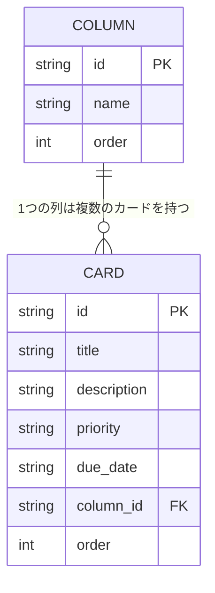

# 設計書：Trello風タスク管理アプリ（仮）— フェーズ2（バックエンド・DB化）

作成日: 2026-08-05
関連ドキュメント: [要件定義書](./要件定義書.md)

学習が進んだ段階で、データの保存先をlocalStorageから自作のバックエンド＋DBに置き換える。ここでの対象外（ログイン・複数ユーザー対応をしない）は変わらない。1人分のデータを、ブラウザではなくサーバー側で管理する、という変更のみ。

## 1. ER図（データの実体と関連）



- COLUMN（列）：todo／doing／doneの3件固定
- CARD（カード）：どの列に属するか（column_id）を持つ。列を消してもカードだけ残る、といった状態を防ぐため、column_idは必ずCOLUMNのいずれかのidを指す

## 2. 使用技術（フェーズ2で追加するもの）

| 項目 | 使うもの | 理由（かんたんな説明） |
|------|----------|--------------------------|
| バックエンド言語／フレームワーク | Java＋Spring Boot | 実務でも広く使われる代表的なバックエンド構成。REST APIを作るための機能がひとまとまりに用意されている |
| ビルドツール | Gradle | Spring Initializrで選べるもう一方の標準的なビルドツール。Mavenと同様、プロジェクトに`gradlew`（ラッパー）が同梱されるため、Gradle自体を別途インストールしなくても動かせる |
| データベース | PostgreSQL | 実務でもよく使われるオープンソースの本格的なRDBMS。SQLiteと異なり、専用のDBサーバーを立てて動かす経験を積める |
| DBとのやり取り | Spring Data JPA（Hibernate） | Spring Bootと組み合わせて使われる定番のORM。Javaのクラスとテーブルを対応づけてDB操作を学べる |
| フロントエンド↔バックエンドの通信 | REST API（JSON）＋CORS設定 | Reactアプリ（別オリジンで動く）からSpring BootのAPIを呼べるように、CORS（他オリジンからのアクセス許可）の設定が必要になる |

> 補足：PostgreSQLをローカルで動かす際は、インストールの手間を減らすためDocker（`docker run` でPostgreSQLコンテナを起動する方法）の利用も検討するとよい。必須ではないので、学習の負担が増えるようなら通常インストールでもよい。

## 3. API設計（概要）

ReactからDBへは直接アクセスできないため、間にAPI（サーバーへのお願いごとの窓口）を用意する。

| メソッド | パス | 内容 |
|----------|------|------|
| GET | /api/columns | 列一覧を取得する |
| GET | /api/cards | カード一覧を取得する。クエリパラメータ `keyword`（タイトル・説明文の部分一致、大文字小文字を区別しない）・`priority`（`high`/`medium`/`low`）・`columnId` を指定すると、それぞれ条件を満たすカードだけに絞り込んで返す（複数指定時はAND条件） |
| POST | /api/cards | カードを新規作成する |
| PUT | /api/cards/:id | カードのタイトル・説明文・優先度・期限・所属する列・並び順を更新する |
| DELETE | /api/cards/:id | カードを削除する |

並び替え（優先度順／期限順）専用のAPIは無く、フロントエンド側で並び替えを計算したうえで、影響を受けた各カードの `order` を `PUT /api/cards/:id` で更新することで実現している。

## 4. フェーズ2の完成の目安

- カードの追加・編集・削除・移動が、localStorageではなくDBに保存されている
- ブラウザを変えたり、いったんサーバーを再起動しても、DBに保存したデータは残っている
- ログイン機能・複数ユーザーの区別は無く、1人分のデータのみを扱う

## 5. バックエンドのローカル起動方法

`backend/` にSpring Boot（Gradle）のひな形を用意済み。起動には以下が必要。

- JDK 21（[Eclipse Temurin](https://adoptium.net/)など）
- Docker Desktop（PostgreSQLをコンテナで動かすため）

```bash
# 1. PostgreSQLコンテナを起動（backend/ ディレクトリで実行）
cd backend
docker compose up -d

# 2. Spring Bootアプリを起動
./gradlew.bat bootRun   # Windows
# ./gradlew bootRun      # Mac/Linux
```

起動後、`http://localhost:8080/api/columns` にアクセスすると列一覧（todo/doing/done）がJSONで返る。`docker-compose.yml`のPostgres設定と`application.properties`のDB接続設定は対応済み。列（COLUMN）の初期データは`data.sql`で自動投入される。

### 動作確認済みの内容（2026-08-06）

- Dockerコンテナ（PostgreSQL 16）を起動し、Spring Bootアプリが`HikariPool`経由で正常に接続できることを確認
- Hibernateが`board_columns`・`cards`の2テーブルを自動作成し、`data.sql`の初期データ（未着手/進行中/完了）が投入されることを確認
- `psql`でDBに直接SQLを実行し、以下がすべて正常に動作することを確認
  - `SELECT`（全件取得・`WHERE`による条件検索・`JOIN`によるカードと列名の結合検索）
  - `INSERT`（カードの新規登録）
  - `DELETE`（カードの削除）
