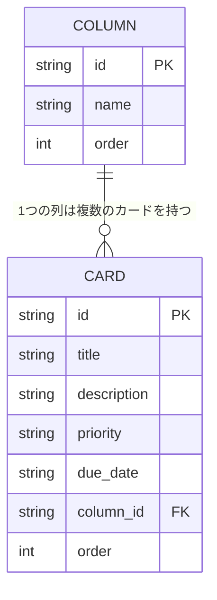

# 設計書：Trello風タスク管理アプリ（仮）— フェーズ2（バックエンド・DB化）

作成日: 2026-08-05
関連ドキュメント: [要件定義書](./要件定義書.md)

学習が進んだ段階で、データの保存先をlocalStorageから自作のバックエンド＋DBに置き換える。ここでの対象外（ログイン・複数ユーザー対応をしない）は変わらない。1人分のデータを、ブラウザではなくサーバー側で管理する、という変更のみ。

## 1. ER図（データの実体と関連）

- COLUMN（列）：todo／doing／doneの3件固定
- CARD（カード）：どの列に属するか（column_id）を持つ。列を消してもカードだけ残る、といった状態を防ぐため、column_idは必ずCOLUMNのいずれかのidを指す

## 2. 使用技術（フェーズ2で追加するもの）

| 項目 | 使うもの | 理由（かんたんな説明） |
|------|----------|--------------------------|
| バックエンド | Node.js＋Express | フロントエンド（React）と同じJavaScriptで書けるので、新しい言語を覚えずに済む |
| データベース | SQLite | ファイル1つで動く軽量なDB。専用のDBサーバーを別途立てなくてよく、個人学習に向いている |
| DBとのやり取り | SQL（学習が進んだらPrismaなどのORMも検討） | まずは生のSQLでテーブル操作の基本を理解してから、便利な道具を足す想定 |

## 3. API設計（概要）

ReactからDBへは直接アクセスできないため、間にAPI（サーバーへのお願いごとの窓口）を用意する。

| メソッド | パス | 内容 |
|----------|------|------|
| GET | /api/columns | 列一覧を取得する |
| GET | /api/cards | カード一覧を取得する |
| POST | /api/cards | カードを新規作成する |
| PUT | /api/cards/:id | カードのタイトル・説明文・優先度・期限・所属する列・並び順を更新する |
| DELETE | /api/cards/:id | カードを削除する |

## 4. フェーズ2の完成の目安

- カードの追加・編集・削除・移動が、localStorageではなくDBに保存されている
- ブラウザを変えたり、いったんサーバーを再起動しても、DBに保存したデータは残っている
- ログイン機能・複数ユーザーの区別は無く、1人分のデータのみを扱う
